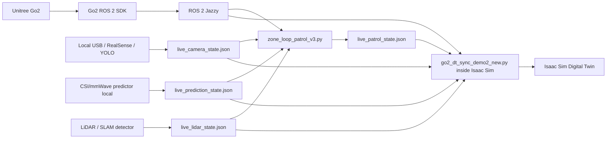

# Unitree Go2 Digital Twin Demo

This repository contains a research-oriented digital twin demo for the **Unitree Go2** robot using **NVIDIA Isaac Sim 5.1**, **ROS 2 Jazzy**, a modified **Go2 ROS 2 SDK**, JSON-based sensor state exchange, YOLO camera perception, CSI/mmWave inference, LiDAR/SLAM state detection, and optional 60 GHz networking through MikroTik/OpenWrt radios and a Raspberry Pi sender.

The key design principle is simple: each perception or radio module writes a **live JSON state file**, and the rest of the system consumes those JSONs. There is no central API server. This makes the system easy to debug, emulate and extend.

---

## 1. What this project does

The demo integrates a real Unitree Go2, a simulated Go2 in Isaac Sim, a ROS 2 control stack, a patrol controller, a visual digital-twin sync script, and several independent sensing modules. The patrol controller uses camera, CSI/mmWave and LiDAR JSON files to decide whether the robot must stop for safety. The Isaac Sim sync script consumes the same state files to update the visual digital twin.

The project supports two main execution architectures:

- **No-Raspi / PC-local architecture**: the PC/Spark host runs the main modules and the cameras are connected directly by USB. The MikroTik AP/STA devices are managed through Ethernet and communicate over the 60 GHz radio link.
- **Raspi + MikroTik architecture**: a Raspberry Pi acts as a remote sender for camera, MP4 video and `iperf` traffic. This traffic crosses the AP13–STA12 60 GHz link and reaches the PC/Spark host.

---

## 2. Documentation map

| Goal | Read this |
|---|---|
| Understand and run the whole project | This `README.md` |
| Main demo scripts and module-by-module execution | [`go2_dt/README.md`](go2_dt/README.md) |
| ROS 2, DDS, Go2 SDK, patrol and Isaac sync | [`go2_dt/ros2_ws/README.md`](go2_dt/ros2_ws/README.md) |
| Required JSON fields and how to add a new sensor | [`docs/json_contracts.md`](docs/json_contracts.md) |
| MikroTik/OpenWrt CSI, AP13/STA12 and Raspi sender | [`docs/mikrotik_csi_openwrt.md`](docs/mikrotik_csi_openwrt.md) |
| Official scripts vs debug/legacy scripts | [`docs/scripts_overview.md`](docs/scripts_overview.md) |
| Python/system dependencies | [`requirements/README.md`](requirements/README.md) |
| Isaac assets and expected prims | [`go2_assets/README.md`](go2_assets/README.md) |

---

## 3. Repository layout

```text
.
├── README.md
├── docs/
│   ├── json_contracts.md
│   ├── mikrotik_csi_openwrt.md
│   ├── scripts_overview.md
│   └── images/
├── requirements/
│   ├── README.md
│   ├── requirements-host.txt
│   ├── requirements-csi.txt
│   └── requirements-yolo.txt
├── go2_assets/
│   └── README.md
└── go2_dt/
    ├── README.md
    ├── ros2_ws/
    │   └── README.md
    ├── camera_yolo/
    │   └── README.md
    ├── csi_dog_dataset_20210421_181125/
    │   └── README.md
    └── tests_experiments/
        ├── raspi_60ghz/
        │   └── README.md
        └── raspi_60ghz_ap13_sta12/
            └── README.md
```

---

## 4. Architectures

### 4.1 Architecture without Raspi

This mode is intended for local development when you do not want to deploy the Raspberry Pi architecture. In this setup, the PC/Spark host is directly connected to the MikroTik AP/STA management network through Ethernet and to the YOLO/AprilTag cameras through USB. The long Ethernet and USB cables replace the Raspberry Pi as a remote sender.


*Figure 1. No-Raspi architecture. The PC/Spark host manages both MikroTik devices through the Ethernet management network `192.168.1.0/24`, while AP13 and STA12 establish the 60 GHz radio link through `wlan0` using the `10.10.10.0/24` subnet. The YOLO and AprilTag cameras are connected directly to the PC through USB.*

Logical software flow:



### 4.2 Architecture with Raspi + MikroTik 60 GHz

This mode is used when the demo includes the Raspberry Pi as a remote sender. The Raspberry Pi sends camera, MP4 and `iperf` traffic through the AP13–STA12 60 GHz link. The PC/Spark host receives those streams and runs the ROS 2 stack, YOLO receiver, CSI predictor and Isaac Sim digital twin.


*Figure 2. Raspi-based architecture. The Raspberry Pi acts as a remote sender for camera, MP4 video and `iperf` traffic. The traffic crosses the AP13–STA12 60 GHz link and reaches the PC/Spark host, where the receivers, YOLO pipeline, CSI predictor, ROS 2 stack and Isaac Sim digital twin are executed.*

---

## 5. Requirements

### 5.1 Host / Spark / main PC

Validated target:

- Ubuntu 24.04.
- ROS 2 Jazzy installed from the official ROS 2 APT repository.
- NVIDIA GPU with Docker GPU support.
- Docker and NVIDIA Container Toolkit.
- NVIDIA Isaac Sim Docker image: `nvcr.io/nvidia/isaac-sim:5.1.0`.
- X11 graphical session.

The host uses **one project Python environment** at:

```text
<repo>/.venv
```

ROS 2 remains a system installation. The venv is created with `--system-site-packages` so that `rclpy`, `cv_bridge`, `tf2_ros` and the rest of the ROS Python stack remain visible.

After ROS 2 Jazzy is installed, create the complete project environment from the repository root:

```bash
bash requirements/setup_host_env.sh
```

This installs and validates the dependencies required by the current host runtime: Go2 WebRTC SDK, CSI inference, YOLOX/camera processing and the Python utilities used by the demo.

The exact system packages, ROS packages, Python packages and validation procedure are documented in [`requirements/README.md`](requirements/README.md).

### 5.2 Robot

Default:

```text
ROBOT_IP=192.168.12.1
CONN_TYPE=webrtc
```

### 5.3 MikroTik/OpenWrt

- AP13 management IP: `192.168.1.13`.
- STA12 management IP: `192.168.1.12`.
- AP13 radio IP: `10.10.10.1`.
- STA12 radio IP: `10.10.10.2`.
- The CSI vendor command runs **on the MikroTik/OpenWrt device**, not on the PC/Spark.
- Repository-side deployment files live under `deployment/openwrt/scripts_csi_dog/` and are installed on STA12 under `/root/scripts_csi_dog/`.
- The current no-Raspi launcher automatically refreshes the live CSI streamer on STA12 before starting it. Dataset-capture helpers are provisioned separately when needed.

For the exact first-time Ethernet provisioning procedure, reverse-SSH prerequisite and manual validation commands, see [`deployment/README.md`](deployment/README.md).

### 5.4 Optional Raspi mode

- Raspberry Pi reachable by SSH.
- Raspi demo IP commonly `172.16.13.100`.
- The canonical setup provisions the Raspberry Pi automatically from `deployment/raspi/raspi_60ghz_demo/`, including the camera/MP4 sender, persistent MP4 loop and iperf loop.
- The setup also copies `go2_dt/media/golden_test.mp4` to the Raspberry Pi and provisions the CSI scripts on STA12 through the Raspberry Pi SSH hop.
- AP13 does not need CSI scripts; its `hostapd` configuration is generated remotely by the setup itself.

See [`deployment/README.md`](deployment/README.md) for the complete provisioning flow.

---

## 6. Build ROS 2 workspace

Create the unified host environment first:

```bash
cd /home/nextnet/AlbertoDir
bash requirements/setup_host_env.sh
```

Then build the workspace **with that same environment active**:

```bash
source /opt/ros/jazzy/setup.bash
source /home/nextnet/AlbertoDir/.venv/bin/activate

cd /home/nextnet/AlbertoDir/go2_dt/ros2_ws

sudo rosdep init 2>/dev/null || true
rosdep update
rosdep install --from-paths src --ignore-src -r -y

colcon build --symlink-install
source install/setup.bash
```

The official launchers check that `.venv` exists and use it for the Go2 SDK, CSI, YOLO and host-side Python processes.

---

## 7. Run without Raspi

### Step 1: Deploy the physical setup

Use Figure 1:

- PC/Spark connected to `192.168.1.0/24`.
- AP13 reachable as `192.168.1.13`.
- STA12 reachable as `192.168.1.12`.
- AP13/STA12 radio subnet `10.10.10.0/24`.
- YOLO USB camera connected to the PC.
- AprilTag USB camera connected to the PC.

### Step 2: Verify MikroTik link

```bash
ssh root@192.168.1.13 'echo AP_OK'
ssh root@192.168.1.12 'echo STA_OK'

ssh root@192.168.1.12 'iw dev wlan0 link'
ssh root@192.168.1.12 'ping -I wlan0 -c 3 10.10.10.1'
ssh root@192.168.1.13 'ping -I wlan0 -c 3 10.10.10.2'
```

### Step 3: Run the current full stack

```bash
cd /home/nextnet/AlbertoDir/go2_dt
./run_full_demo_current.sh
```

This launches Isaac Sim, Go2 SDK, SLAM live visual, local USB YOLO, CSI predictor, throughput plot, radio/video/iperf helpers and `zone_loop_patrol_v3.py`.

### Step 4: Stop

```bash
cd /home/nextnet/AlbertoDir/go2_dt
./stop_full_demo_current.sh
```

---

## 8. Run with Raspi

### Step 1: Deploy the physical setup

Use Figure 2. The Raspberry Pi sends:

- camera RTP on UDP `6000`;
- MP4 RTP on UDP `6002`;
- `iperf` traffic on port `5201`.

### Step 2: Configure AP13/STA12/Raspi

```bash
cd /home/nextnet/AlbertoDir/go2_dt

RASPI_MGMT_HOST=10.39.251.226 \
RASPI_USER=nextnet \
./tests_experiments/raspi_60ghz_ap13_sta12/setup_ap13_sta12_link_raspi_wifi.sh
```

### Step 3: Run the Raspi/AP13/STA12 pipeline

```bash
cd /home/nextnet/AlbertoDir/go2_dt

RASPI_HOST=172.16.13.100 \
RASPI_MGMT_HOST=10.39.251.226 \
SPARK_IP=172.16.12.170 \
STA_MGMT_HOST=192.168.1.12 \
ENABLE_CAMERA=1 \
ENABLE_MP4=1 \
ENABLE_IPERF=1 \
ENABLE_CSI=0 \
./tests_experiments/raspi_60ghz_ap13_sta12/run_ap13_sta12_pipeline.sh
```

### Step 4: Use your own MP4 on the Raspi

```bash
scp my_video.mp4 nextnet@172.16.13.100:/home/nextnet/raspi_60ghz_demo/my_video.mp4
```

```bash
MP4_FILE=/home/nextnet/raspi_60ghz_demo/my_video.mp4 \
ENABLE_MP4=1 \
/home/system/raspi_60ghz_demo/raspi_60ghz_sender.sh
```

If you change only `MP4_FILE`, the Spark receiver does not need to change. If you change `MP4_PORT`, update both sender and receiver.

### Step 5: Stop

```bash
cd /home/nextnet/AlbertoDir/go2_dt
./tests_experiments/raspi_60ghz_ap13_sta12/stop_ap13_sta12_pipeline.sh
```

or:

```bash
./stop_full_demo_current.sh
```

---

## 9. Run Isaac Sim separately

Use this when you want to test only the digital twin or open/edit scenes manually.

```bash
xhost +local:docker

docker run --rm -it \
  --name isaac-sim-gui \
  --gpus all \
  --network=host \
  --ipc=host \
  --ulimit memlock=-1 \
  --ulimit stack=67108864 \
  -e ACCEPT_EULA=Y \
  -e PRIVACY_CONSENT=Y \
  -e DISPLAY=$DISPLAY \
  -e XAUTHORITY=$XAUTHORITY \
  -v /tmp/.X11-unix:/tmp/.X11-unix:rw \
  -v $XAUTHORITY:$XAUTHORITY:rw \
  -v ~/AlbertoDir/isaac51/cache/main/ov:/home/ubuntu/.cache/ov:rw \
  -v ~/AlbertoDir/isaac51/cache/main/warp:/home/ubuntu/.cache/warp:rw \
  -v ~/AlbertoDir/isaac51/cache/computecache:/home/ubuntu/.nv/ComputeCache:rw \
  -v ~/AlbertoDir/isaac51/config:/home/ubuntu/.nvidia-omniverse/config:rw \
  -v ~/AlbertoDir/isaac51/data/documents:/home/ubuntu/Documents:rw \
  -v ~/AlbertoDir/isaac51/data/Kit:/home/ubuntu/.local/share/ov/data/Kit:rw \
  -v ~/AlbertoDir/isaac51/logs:/home/ubuntu/.nvidia-omniverse/logs:rw \
  -v ~/AlbertoDir:/workspace:rw \
  --entrypoint /bin/bash \
  nvcr.io/nvidia/isaac-sim:5.1.0 \
  -lc 'cd /isaac-sim && ./runapp.sh'
```

Then use **File → Open** inside Isaac Sim and browse inside `/workspace`. The validated scene is:

```text
/workspace/go2_assets/go2/prueba_demo2_new_scenario.usd
```

The sync script can be run from Isaac's Script Editor or Python console:

```python
exec(open("/workspace/go2_dt/ros2_ws/go2_dt_sync_demo2_new.py").read())
```

That `exec(...)` method is optional. The normal workflow is to open Isaac Sim, use **File → Open** to load the USD stage, and run the sync script only when live synchronization is required.

---

## 10. Run Go2 SDK separately

```bash
cd /home/nextnet/AlbertoDir/go2_dt/ros2_ws
source /opt/ros/jazzy/setup.bash
source install/setup.bash

export ROBOT_IP=192.168.12.1
export CONN_TYPE=webrtc
export ROS_DOMAIN_ID=0
export RMW_IMPLEMENTATION=rmw_cyclonedds_cpp

ros2 launch go2_robot_sdk webrtc_web.launch.py
```

The SDK launcher remaps:

```text
cmd_vel_out -> cmd_vel
```

This is why the patrol script publishes to `/cmd_vel_out`.

---

## 11. Hardcoded paths and how to change them

Several scripts were validated with:

```text
/home/nextnet/AlbertoDir/go2_dt
```

and Isaac Sim expects the project to be visible inside Docker as:

```text
/workspace
```

Changing the project directory affects:

- `GO2_ROOT` in shell scripts;
- `ROS_WS` in shell scripts;
- JSON paths in `zone_loop_patrol_v3.py`;
- JSON paths in `go2_dt_sync_demo2_new.py`;
- Docker volume mounts;
- OpenWrt CSI `PC_FILE`;
- Raspi sender paths.

Recommended reproducible approach:

```bash
mkdir -p /home/nextnet/AlbertoDir
ln -s /home/nextnet/unitree_go2_dt_isaacsim_clean/go2_dt /home/nextnet/AlbertoDir/go2_dt
ln -s /home/nextnet/unitree_go2_dt_isaacsim_clean/go2_assets /home/nextnet/AlbertoDir/go2_assets
```

If you change the base directory instead, update all of these consistently:

| Place | What to change | What it affects |
|---|---|---|
| `run_full_demo_current.sh` | `GO2_ROOT`, `ROS_WS`, Docker `-v` mount | Full launcher, Isaac mount, ROS paths |
| `stop_full_demo_current.sh` | `GO2_ROOT`, process paths if needed | Cleanup |
| `zone_loop_patrol_v3.py` | `input_file`, `output_file`, `patrol_state_path`, sensor JSON paths | Patrol, safety stop, route replay |
| `go2_dt_sync_demo2_new.py` | `/workspace/...` and `/home/nextnet/AlbertoDir/...` constants | Isaac sync and visualization |
| OpenWrt CSI scripts | `PC_FILE` | Live CSI stream target |
| Raspi sender | `MP4_FILE`, log paths if needed | Video streaming |

---

## 12. JSON integration

Read the full contract here:

```text
docs/json_contracts.md
```

Minimal examples:

```json
{
  "status": "online",
  "person_detected": true
}
```

```json
{
  "status": "online",
  "prediction": "person"
}
```

Important: the patrol and sync scripts use the **file modification time** to determine freshness. A sensor producer must rewrite the JSON file periodically even if the semantic state does not change.

---

## 13. Acknowledgements

This repository builds on and integrates several open-source and research tools:

- **Unitree Go2 ROS 2 SDK / RoboVerse community components**, adapted for this demo.
- **NVIDIA Isaac Sim**, used as the digital twin simulation environment.
- **YOLOX**, used for camera-based person detection.
- **ROS 2 Jazzy**, used as the robotics middleware.
- **MikroTik/OpenWrt CSI tooling**, adapted for live CSI/mmWave-inspired sensing experiments.
- The UC3M/Spark demo environment and the physical 60 GHz AP13/STA12 testbed used to validate the pipeline.

Please check the license of each upstream component before redistributing modified versions.
