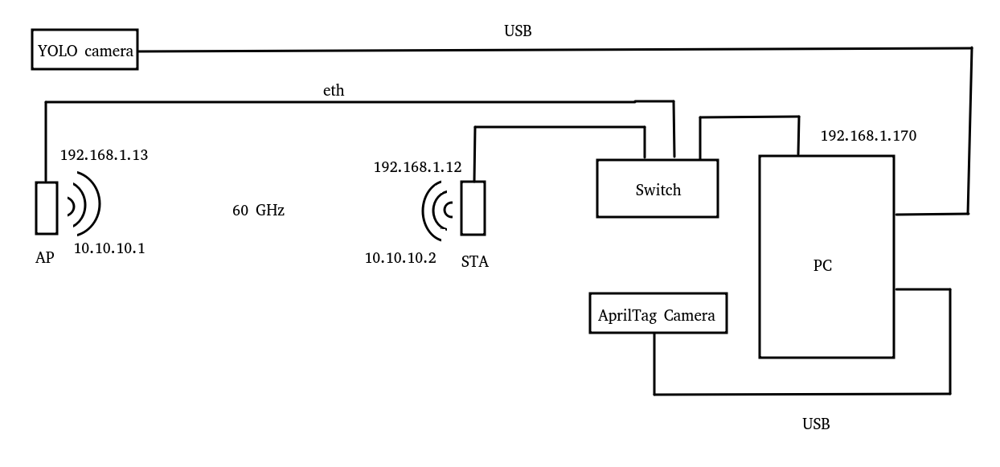
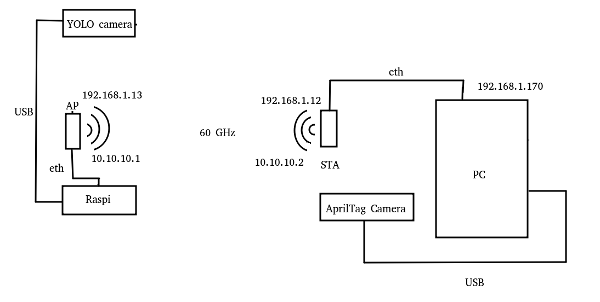
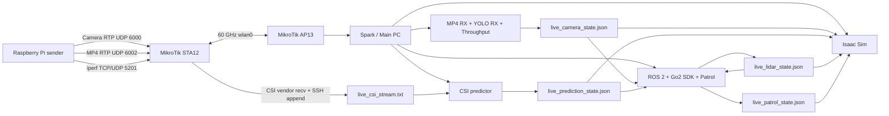

# Unitree Go2 Digital Twin Demo

This repository contains a research-oriented digital twin demo for the **Unitree Go2** robot using **NVIDIA Isaac Sim 5.1**, **ROS 2 Jazzy**, a modified **Go2 ROS 2 SDK**, JSON-based sensor state exchange, YOLO camera perception, CSI/mmWave inference, LiDAR/SLAM state detection, and optional 60 GHz networking through MikroTik/OpenWrt radios and a Raspberry Pi sender.

The key design principle is simple: each perception or radio module writes a **live JSON state file**, and the rest of the system consumes those JSONs. There is no central API server. This makes the system easy to debug, emulate and extend.

---

## 1. What this project does

The demo integrates:

- a real Unitree Go2 controlled through ROS 2;
- a simulated Go2 in Isaac Sim;
- a patrol controller that records and replays a route;
- safety-stop logic based on camera, CSI/mmWave and LiDAR state files;
- a visual sync script that updates Isaac Sim with robot pose, legs, LiDAR cloud and person visibility;
- two execution architectures:
  - **PC/local mode**, where the main PC runs most modules;
  - **Raspi + MikroTik mode**, where a Raspberry Pi sends camera/MP4/iperf streams through a 60 GHz AP/STA link and OpenWrt provides CSI measurements.

---

## 2. Repository layout

```text
.
├── README.md
├── docs/
│   ├── json_contracts.md
│   ├── mikrotik_csi_openwrt.md
│   ├── scripts_overview.md
│   └── images/
├── go2_assets/
│   └── README.md
└── go2_dt/
    ├── README.md
    ├── ros2_ws/
    │   └── README.md
    ├── camera_yolo/
    │   └── README.md
    ├── csi_dog_dataset_20210421_181125/
    │   └── README.md
    └── tests_experiments/
        ├── raspi_60ghz/
        │   └── README.md
        └── raspi_60ghz_ap13_sta12/
            └── README.md
```

---

## 3. Architectures

### 3.1 Architecture without Raspi

This mode is intended for local development if you do not want to deploy the Raspberry Pi architecture. In this setup, the PC/Spark host is directly connected to the MikroTik AP/STA management network through Ethernet and to the YOLO/AprilTag cameras through USB.



*Figure 1. No-Raspi architecture. The PC/Spark host manages both MikroTik devices through the Ethernet management network `192.168.1.0/24`, while AP13 and STA12 establish the 60 GHz radio link through `wlan0` using the `10.10.10.0/24` subnet. The YOLO and AprilTag cameras are connected directly to the PC through USB.*

```mermaid
flowchart LR
    GO2[Unitree Go2] --> SDK[Go2 ROS 2 SDK]
    SDK --> ROS[ROS 2 Jazzy]
    ROS --> Patrol[zone_loop_patrol_v3.py]
    ROS --> Sync[go2_dt_sync_demo2_new.py inside Isaac Sim]

    Camera[Local USB / RealSense / YOLO] --> CameraJSON[live_camera_state.json]
    CSI[CSI/mmWave predictor local] --> CSIJSON[live_prediction_state.json]
    Lidar[LiDAR / SLAM detector] --> LidarJSON[live_lidar_state.json]

    CameraJSON --> Patrol
    CSIJSON --> Patrol
    LidarJSON --> Patrol

    CameraJSON --> Sync
    CSIJSON --> Sync
    LidarJSON --> Sync
    Patrol --> PatrolJSON[live_patrol_state.json]
    PatrolJSON --> Sync
    Sync --> Isaac[Isaac Sim Digital Twin]

Recommended image placeholder:

```text
docs/images/architecture_without_raspi.png
```

### 3.2 Architecture with Raspi + MikroTik 60 GHz

This mode is used when the demo includes the Raspi



*Figure 2. Raspi-based architecture. The Raspberry Pi acts as a remote sender for camera, MP4 video and `iperf` traffic. The traffic crosses the AP13–STA12 60 GHz link and reaches the PC/Spark host, where the receivers, YOLO pipeline, CSI predictor, ROS 2 stack and Isaac Sim digital twin are executed.*



Recommended image placeholder:

```text
docs/images/architecture_with_raspi.png
```

---

## 4. Requirements

### Host / Spark / main PC

- Ubuntu 22.04/24.04 recommended.
- NVIDIA GPU with Docker GPU support.
- Docker and NVIDIA Container Toolkit.
- NVIDIA Isaac Sim Docker image:

```bash
docker pull nvcr.io/nvidia/isaac-sim:5.1.0
```

- ROS 2 Jazzy.
- Python 3.
- `colcon`, `rosdep`, `rclpy`, OpenCV, GStreamer, `iperf3`, `tcpdump`, `v4l2-ctl`.
- X11 graphical session with `gnome-terminal` or `xterm`.

### Robot

Default:

```text
ROBOT_IP=192.168.12.1
CONN_TYPE=webrtc
```

### Optional Raspi/MikroTik mode

- Raspberry Pi reachable by SSH.
- MikroTik/OpenWrt AP and STA reachable by SSH.
- CSI scripts installed under `/root/scripts_csi_dog/`.
- Raspi sender installed under `/home/system/raspi_60ghz_demo/`.

---

## 5. Quick build

```bash
cd /home/nextnet/AlbertoDir/go2_dt/ros2_ws

source /opt/ros/jazzy/setup.bash

rosdep update
rosdep install --from-paths src --ignore-src -r -y

colcon build --symlink-install
source install/setup.bash
```

---

## 6. Quick execution

### Isaac Sim

Open the USD stage:

```text
/workspace/go2_assets/go2/prueba_demo2_new_scenario.usd
```

Then run inside Isaac Sim:

```python
exec(open("/workspace/go2_dt/ros2_ws/go2_dt_sync_demo2_new.py").read())
```

### Go2 SDK

```bash
cd /home/nextnet/AlbertoDir/go2_dt/ros2_ws
source /opt/ros/jazzy/setup.bash
source install/setup.bash

export ROBOT_IP=192.168.12.1
export CONN_TYPE=webrtc
export ROS_DOMAIN_ID=0
export RMW_IMPLEMENTATION=rmw_cyclonedds_cpp

ros2 launch go2_robot_sdk webrtc_web.launch.py
```

### Full demo

```bash
cd /home/nextnet/AlbertoDir/go2_dt
./run_full_demo_current.sh
```

Stop:

```bash
cd /home/nextnet/AlbertoDir/go2_dt
./stop_full_demo_current.sh
```

---

## 7. Documentation index

- `docs/json_contracts.md`: exact JSON fields consumed by patrol and sync.
- `docs/mikrotik_csi_openwrt.md`: AP13/STA12, CSI streaming, capture countdown and Raspi sender.
- `docs/scripts_overview.md`: official scripts and how to test them.
- `go2_dt/ros2_ws/README.md`: ROS 2, DDS, SDK, patrol and Isaac sync.
- `go2_assets/README.md`: Isaac Sim assets, expected prims and `/workspace` mount.
